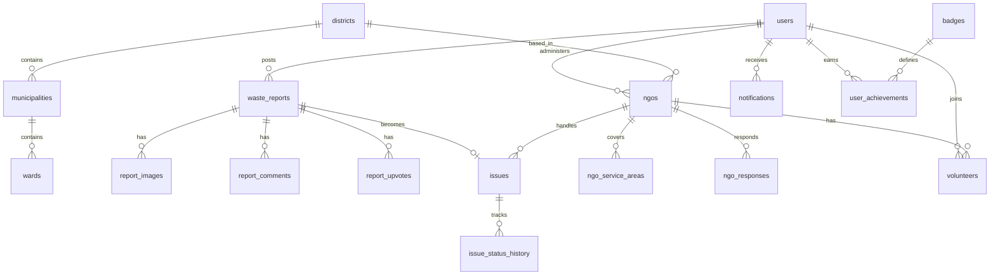

# Make Kerala Clean — Database Design

> **Last updated:** 2026-06-28  
> **Engine:** PostgreSQL 16  
> **ORM:** SQLAlchemy 2.x  
> **Migrations:** Alembic  

This document is the **canonical reference** for all tables, audit columns, relationships, and which API routes write to each table.

Related: [LLD.md](LLD.md) · [DECISIONS.md](DECISIONS.md) · [analytics-map.md](analytics-map.md)

---

## 1. Design principles

1. **Every business table is auditable** — who created/updated, when, and which API route.
2. **Append-only history** — `row_audit_logs` stores full before/after JSON on insert and update.
3. **UUID primary keys** on all entities.
4. **Timestamps in UTC** (`TIMESTAMPTZ`).
5. **Soft secrets** — passwords, OTPs, token hashes are redacted in audit JSON.
6. **Geography normalized** — `districts` → `municipalities` → `wards` with FK links on reports and users (text name fields kept for backward compatibility during migration).

---

## 2. Audit standard (every table except `row_audit_logs`)

Every auditable row includes these columns (via `AuditMixin` in `backend/app/db/mixins.py`):

| Column | Type | Description |
|--------|------|-------------|
| `created_at` | TIMESTAMPTZ | Row first inserted (server default `now()`) |
| `updated_at` | TIMESTAMPTZ | Last modification time |
| `created_by_user_id` | UUID → `users.id` | User who created the row (NULL for system/seed/guest) |
| `updated_by_user_id` | UUID → `users.id` | User who last updated the row |
| `created_by_api` | VARCHAR(160) | API route at create, e.g. `POST /api/v1/reports` |
| `updated_by_api` | VARCHAR(160) | API route at last update |
| `created_ip` | VARCHAR(45) | Client IP at create |
| `updated_ip` | VARCHAR(45) | Client IP at last update |
| `row_version` | INTEGER | Optimistic-lock counter; increments on each update |

### How audit fields are populated

```
HTTP request
  → AuditMiddleware reads JWT + method + path + IP
  → audit_context ContextVar set for request lifetime
  → SQLAlchemy before_insert / before_update fills AuditMixin columns
  → after_commit writes row_audit_logs entry
```

**System jobs** (seed, cron) must wrap writes with:

```python
from app.core.audit_context import audit_info_for_system, set_audit_info, reset_audit_info

token = set_audit_info(audit_info_for_system("system/seed"))
try:
    ...
finally:
    reset_audit_info(token)
```

---

## 3. Change history table

### `row_audit_logs` (append-only, no AuditMixin)

| Column | Type | Description |
|--------|------|-------------|
| `id` | UUID PK | |
| `table_name` | VARCHAR(80) | e.g. `waste_reports` |
| `row_id` | UUID | PK of changed row |
| `action` | VARCHAR(20) | `insert` or `update` |
| `old_values` | JSONB | Previous field values (NULL on insert) |
| `new_values` | JSONB | Full row snapshot after change |
| `changed_by_user_id` | UUID | From JWT |
| `changed_by_api` | VARCHAR(160) | e.g. `PUT /api/v1/issues/{id}/progress` |
| `changed_ip` | VARCHAR(45) | |
| `changed_at` | TIMESTAMPTZ | When change was committed |

**Query example:**

```sql
SELECT changed_at, changed_by_api, action, old_values->>'status', new_values->>'status'
FROM row_audit_logs
WHERE table_name = 'waste_reports' AND row_id = '...'
ORDER BY changed_at DESC;
```

---

## 4. Entity relationship overview



---

## 5. Stage 1 tables

### 5.1 Geography

#### `districts`

| Column | Type | Notes |
|--------|------|-------|
| `id` | UUID PK | |
| `name` | VARCHAR(120) | e.g. `Thiruvananthapuram` |
| `slug` | VARCHAR(120) UNIQUE | e.g. `thiruvananthapuram` |
| `census_code` | INT | Optional census ID |
| `state_name` | VARCHAR(60) | Default `Kerala` |
| + audit columns | | |

**Written by:** `system/seed`, future `POST /api/v1/admin/geography/districts`

#### `municipalities`

| Column | Type | Notes |
|--------|------|-------|
| `id` | UUID PK | |
| `district_id` | UUID FK | → `districts.id` |
| `name` | VARCHAR(160) | |
| `slug` | VARCHAR(160) | Unique per district |
| `local_body_type` | ENUM | `corporation`, `municipality`, `gram_panchayat` |
| + audit columns | | |

#### `wards`

| Column | Type | Notes |
|--------|------|-------|
| `id` | UUID PK | |
| `municipality_id` | UUID FK | → `municipalities.id` |
| `name` | VARCHAR(160) | |
| `slug` | VARCHAR(160) | Unique per municipality |
| `ward_number` | INT | Optional official number |
| + audit columns | | |

---

### 5.2 Users & auth

#### `users`

| Column | Type | Notes |
|--------|------|-------|
| `id` | UUID PK | |
| `name` | VARCHAR(120) | |
| `email` | VARCHAR(255) UNIQUE | |
| `phone` | VARCHAR(20) | Optional |
| `password_hash` | VARCHAR(255) | bcrypt |
| `role` | ENUM | `citizen`, `ngo_admin`, `volunteer`, `system_admin` |
| `is_email_verified` | BOOL | |
| `is_active` | BOOL | |
| `home_latitude` / `home_longitude` | FLOAT | Profile location |
| `home_ward` / `home_municipality` / `home_district` | VARCHAR(120) | Text (legacy + display) |
| `home_ward_id` / `home_municipality_id` / `home_district_id` | UUID FK | → geography |
| + audit columns | | |

| API route | Action |
|-----------|--------|
| `POST /api/v1/auth/register` | INSERT |
| `POST /api/v1/auth/verify-email` | UPDATE `is_email_verified` |
| `PUT /api/v1/profile/location` | UPDATE home location |

#### `email_otps`

| Column | Type | Notes |
|--------|------|-------|
| `id` | UUID PK | |
| `user_id` | UUID FK | |
| `email` | VARCHAR(255) | |
| `otp_code` | VARCHAR(6) | Redacted in audit log |
| `purpose` | ENUM | `email_verification`, `password_reset` |
| `expires_at` | TIMESTAMPTZ | |
| `used_at` | TIMESTAMPTZ | NULL until consumed |
| + audit columns | | |

#### `refresh_tokens`

| Column | Type | Notes |
|--------|------|-------|
| `id` | UUID PK | |
| `user_id` | UUID FK | |
| `token_hash` | VARCHAR(64) | Redacted in audit log |
| `expires_at` | TIMESTAMPTZ | |
| `revoked_at` | TIMESTAMPTZ | Set on logout |
| + audit columns | | |

---

### 5.3 Reports & feed

#### `waste_reports`

| Column | Type | Notes |
|--------|------|-------|
| `id` | UUID PK | |
| `user_id` | UUID FK | Citizen author |
| `category` | ENUM | Waste type |
| `description` | TEXT | |
| `address` | VARCHAR(500) | |
| `ward_name` / `municipality_name` / `district_name` | VARCHAR(120) | Free text |
| `ward_id` / `municipality_id` / `district_id` | UUID FK | Normalized geography |
| `latitude` / `longitude` | FLOAT | GPS |
| `status` | ENUM | `posted`, `pending_ngo`, `accepted`, `resolved`, `closed` |
| `upvote_count` | INT | Denormalized counter |
| `comment_count` | INT | Denormalized counter |
| + audit columns | | |

| API route | Action |
|-----------|--------|
| `POST /api/v1/reports` | INSERT |
| `POST /api/v1/ngos/{id}/accept/{report_id}` | UPDATE status → `accepted` |
| Issue resolve flow | UPDATE status → `resolved` / `closed` |

#### `report_images`

| Column | Type | Notes |
|--------|------|-------|
| `id` | UUID PK | |
| `report_id` | UUID FK | |
| `file_path` | VARCHAR(500) | Relative upload path |
| `image_type` | ENUM | `report`, `completion` |
| `source` | VARCHAR(20) | Always `camera` |
| `captured_at` | TIMESTAMPTZ | From device metadata |
| `latitude` / `longitude` | FLOAT | Capture location |
| `waste_confidence` | FLOAT | ML Kit score |
| `waste_labels` | VARCHAR(500) | Comma-separated labels |
| + audit columns | | |

| API route | Action |
|-----------|--------|
| `POST /api/v1/reports` | INSERT (`image_type=report`) |
| `POST /api/v1/issues/{id}/complete` | INSERT (`image_type=completion`) |

#### `report_comments`

| Column | Type | Notes |
|--------|------|-------|
| `id` | UUID PK | |
| `report_id` | UUID FK | |
| `user_id` | UUID FK | |
| `body` | TEXT | |
| `is_deleted` | BOOL | Soft delete |
| + audit columns | | |

| API route | Action |
|-----------|--------|
| `POST /api/v1/reports/{id}/comments` | INSERT |

#### `report_upvotes`

| Column | Type | Notes |
|--------|------|-------|
| `id` | UUID PK | |
| `report_id` | UUID FK | |
| `user_id` | UUID FK | UNIQUE with report_id |
| + audit columns | | |

| API route | Action |
|-----------|--------|
| `POST /api/v1/reports/{id}/upvote` | INSERT |

---

### 5.4 NGOs

#### `ngos`

| Column | Type | Notes |
|--------|------|-------|
| `id` | UUID PK | |
| `admin_user_id` | UUID FK | NGO admin account |
| `name` | VARCHAR(200) | |
| `district_id` | UUID FK | Optional |
| `contact_email` / `contact_phone` | | |
| `logo_url` | VARCHAR(500) | |
| `description` | TEXT | |
| `is_verified` | BOOL | Admin approval |
| `is_active` | BOOL | |
| + audit columns | | |

#### `ngo_service_areas`

| Column | Type | Notes |
|--------|------|-------|
| `id` | UUID PK | |
| `ngo_id` | UUID FK | |
| `ward_id` | UUID FK | Optional ward match |
| `radius_km` | FLOAT | Optional radius match |
| `center_latitude` / `center_longitude` | FLOAT | Center for radius |
| + audit columns | | |

#### `ngo_responses`

| Column | Type | Notes |
|--------|------|-------|
| `id` | UUID PK | |
| `ngo_id` | UUID FK | |
| `report_id` | UUID FK | UNIQUE with ngo_id |
| `action` | ENUM | `accept`, `reject` |
| `reason` | TEXT | Required on reject |
| + audit columns | | |

| API route | Action |
|-----------|--------|
| `POST /api/v1/ngos/{id}/accept/{report_id}` | INSERT action=accept |
| `POST /api/v1/ngos/{id}/reject/{report_id}` | INSERT action=reject |

---

### 5.5 Issues

#### `issues`

| Column | Type | Notes |
|--------|------|-------|
| `id` | UUID PK | |
| `report_id` | UUID FK UNIQUE | One issue per report |
| `ngo_id` | UUID FK | Assigned NGO |
| `assigned_volunteer_id` | UUID FK | Optional |
| `status` | ENUM | `open`, `in_progress`, `resolved`, `closed` |
| `completion_image_id` | UUID FK | → `report_images.id` |
| `resolved_at` / `closed_at` | TIMESTAMPTZ | |
| `notes` | TEXT | |
| + audit columns | | |

#### `issue_status_history`

| Column | Type | Notes |
|--------|------|-------|
| `id` | UUID PK | |
| `issue_id` | UUID FK | |
| `old_status` | VARCHAR(40) | |
| `new_status` | VARCHAR(40) | |
| `note` | TEXT | |
| + audit columns | | |

---

### 5.6 Notifications & volunteers

#### `notifications`

| Column | Type | Notes |
|--------|------|-------|
| `id` | UUID PK | |
| `user_id` | UUID FK | Recipient |
| `type` | ENUM | See model |
| `title` / `body` | | |
| `reference_type` / `reference_id` | | Polymorphic link |
| `is_read` / `read_at` | | |
| + audit columns | | |

#### `volunteers`

| Column | Type | Notes |
|--------|------|-------|
| `id` | UUID PK | |
| `ngo_id` | UUID FK | |
| `user_id` | UUID FK | UNIQUE with ngo_id |
| `status` | ENUM | `pending`, `active`, `inactive` |
| + audit columns | | |

---

### 5.7 Achievements

#### `badges`

| Column | Type | Notes |
|--------|------|-------|
| `id` | UUID PK | |
| `code` | VARCHAR(60) UNIQUE | e.g. `closes_10` |
| `name` | VARCHAR(120) | Display name |
| `description` | VARCHAR(500) | |
| `milestone_threshold` | INT | 10, 100, 1000… |
| `tier` | ENUM | bronze, silver, gold, platinum |
| `icon_key` | VARCHAR(60) | |
| `is_active` | BOOL | |
| + audit columns | | |

#### `user_achievements`

| Column | Type | Notes |
|--------|------|-------|
| `id` | UUID PK | |
| `user_id` | UUID FK | |
| `badge_id` | UUID FK | UNIQUE pair |
| + audit columns | | |

#### `close_counters`

| Column | Type | Notes |
|--------|------|-------|
| `id` | UUID PK | |
| `entity_type` | ENUM | `user`, `ngo` |
| `entity_id` | UUID | User or NGO id |
| `close_count` | INT | Running total |
| + audit columns | | |

---

### 5.8 Content

#### `awareness_quotes`

| Column | Type | Notes |
|--------|------|-------|
| `id` | UUID PK | |
| `text` | TEXT | |
| `author` | VARCHAR(120) | |
| `is_active` | BOOL | |
| + audit columns | | |

---

## 6. Stage 2 tables (planned)

`officials` · `escalations` · `govt_assignments` · `sla_rules` · `partnership_agreements`

All will use the same `AuditMixin` pattern.

---

## 7. Stage 3 tables (planned)

`funding_sources` · `donations` · `expenses` · `funding_ledger` · `donation_campaigns` · `ai_classifications` · `rankings`

`funding_ledger` is append-only (audit via `created_*` only, no updates).

---

## 8. Setup & migrations

### Fresh database

```bash
cd backend
docker compose up -d
pip install -r requirements.txt
alembic upgrade head          # preferred
# OR on first dev boot: create_all via uvicorn (main.py lifespan)
uvicorn app.main:app --reload
```

### Create a new migration after model change

```bash
cd backend
alembic revision --autogenerate -m "describe change"
alembic upgrade head
```

### Model files

```
backend/app/models/
  geography.py      districts, municipalities, wards
  user.py           users
  email_otp.py      email_otps
  refresh_token.py  refresh_tokens
  waste_report.py   waste_reports
  report_image.py   report_images
  social.py         report_comments, report_upvotes, notifications
  ngo.py            ngos, ngo_service_areas, ngo_responses
  issue.py          issues, issue_status_history
  volunteer.py      volunteers
  achievement.py    badges, user_achievements, close_counters
  quote.py          awareness_quotes
  row_audit_log.py  row_audit_logs
```

---

## 9. API → table write map (Stage 1)

| API | Tables written |
|-----|----------------|
| `POST /auth/register` | `users`, `email_otps`, `row_audit_logs` |
| `POST /auth/verify-email` | `users`, `email_otps` |
| `POST /auth/login` | `refresh_tokens` |
| `POST /auth/logout` | `refresh_tokens` |
| `PUT /profile/location` | `users` |
| `POST /reports` | `waste_reports`, `report_images` |
| `POST /reports/{id}/comments` | `report_comments`, `waste_reports` (count) |
| `POST /reports/{id}/upvote` | `report_upvotes`, `waste_reports` (count) |
| `POST /ngos` | `ngos` |
| `POST /ngos/{id}/accept/{report_id}` | `ngo_responses`, `waste_reports`, `issues`, `issue_status_history`, `notifications` |
| `POST /ngos/{id}/reject/{report_id}` | `ngo_responses` |
| `PUT /issues/{id}/progress` | `issues`, `issue_status_history` |
| `POST /issues/{id}/complete` | `issues`, `report_images`, `issue_status_history` |
| `POST /issues/{id}/confirm` | `issues`, `waste_reports`, `close_counters`, `user_achievements`, `notifications` |

---

## 10. Change log

| Date | Change |
|------|--------|
| 2026-06-28 | Initial complete DB design with AuditMixin on all Stage 1 tables + row_audit_logs |
